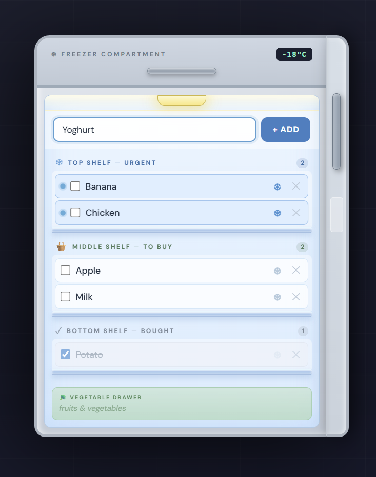
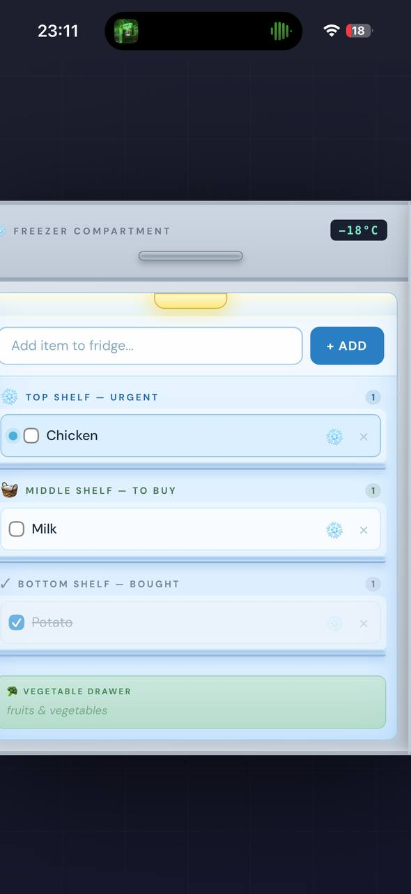

# ❄️ Shared Fridge — Smart Grocery Manager

A fast, real-time, fridge-themed grocery manager for shared households to track and prioritize shopping lists.

## Demo




## Product Context

**End users:** Roommates, families, or couples sharing a household who need to manage daily grocery supplies.

**Problem that your product solves for end users:** Syncing grocery needs manually is tedious. Roommates often forget missing items, buy duplicates, or struggle to effectively communicate urgent household needs to each other.

**Your solution:** A real-time, synchronized smart grocery list designed as a "virtual fridge." It allows users to collaboratively manage supplies, automatically sorts items alphabetically, and uses visual cues to prioritize urgent purchases.

## Features

**Implemented features:**
* **Fridge-Door Interface:** A modern, immersive UI mimicking the interior of an open refrigerator with glass shelves.
* **Smart Sorting Algorithm:** Items are automatically grouped by status and sorted in alphabetical order to keep the list neat.
* **Priority Tracking:** Support for marking essential items as "Urgent" (snowflake icon), which pins them to the Top Shelf with a visual indicator.
* **Bought Status:** Checking off items automatically moves them to the Bottom Shelf and crosses them out.
* **Dockerized Stack:** Fully containerized Backend (FastAPI, SQLite) and Frontend (HTML/JS/Tailwind CSS).

**Not yet implemented features:**
* **AI Agent Integration:** Natural language processing for adding ingredients from recipes (pivoted to manual entry to ensure 100% uptime and remove unstable third-party API dependencies).
* **User Authentication:** Personal accounts to track exactly *who* added or bought a specific item.
* **Push Notifications:** Alerting roommates on their phones when an "Urgent" item is added to the fridge.

## Usage

1. **Open the App:** Navigate to the web interface using your browser.
2. **Add an Item:** Type the name of the grocery item (e.g., "Milk") in the input field and click the **+ ADD** button. It will appear on the Middle Shelf.
3. **Mark as Urgent:** Click the **Snowflake (❄)** icon next to an item. It will immediately move to the Top Shelf so no one misses it.
4. **Mark as Bought:** When someone buys the item, click the **Checkbox**. The item will be crossed out, the urgency button will lock, and it will drop to the Bottom Shelf.
5. **Delete:** Click the **✕** button to completely remove an item from the database.

## Deployment

**Which OS the VM should run on:** Ubuntu 24.04 LTS (Standard University VM setup)

**What should be installed on the VM:** * Git
* Docker
* Docker Compose

**Step-by-step deployment instructions:**
1. **Connect to your VM:**
   SSH into your Ubuntu 24.04 instance.

2. Clone the Repository
```bash
git clone [https://github.com/ixkci/se-toolkit-hackathon.git](https://github.com/ixkci/se-toolkit-hackathon.git)
   cd se-toolkit-hackathon
```

3. Update the API URL:
Open index.html and ensure the API_URL variable points to your VM:

``` JavaScript
const API_URL = '[http://10.93.25.96:8000/items/](http://10.93.25.96:8000/items/)';
```
4. Build and start the containers:
Run this Docker Compose command to deploy in detached mode:
```bash
docker compose up --build -d
```
5.  Access the application:

Frontend Interface: Open http://YOUR_VM_IP:8080 in a web browser.

API Documentation: Open http://YOUR_VM_IP:8000/docs.
## 📝 Remote Deployment (VM)

If running on a Virtual Machine, ensure the API address in `index.html` matches your VM's IP address:

```javascript
const API_URL = 'http://YOUR_VM_IP:8000/items/';
```

## 🤝 Project Info

**Author:** Maksim Beketov  
Developed for the **Software Engineering Toolkit Hackathon 2026**.

